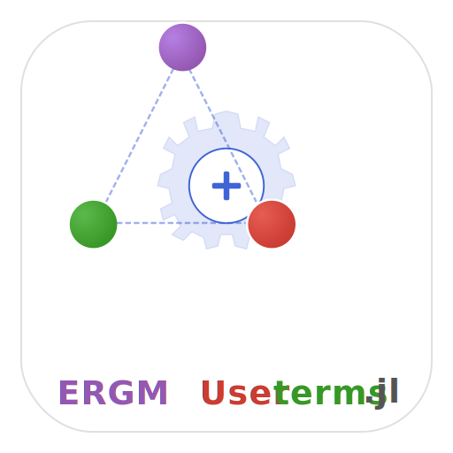

# ERGMUserterms.jl


[](https://github.com/statistical-network-analysis-with-Julia/ERGMUserterms.jl)
[](https://github.com/statistical-network-analysis-with-Julia/ERGMUserterms.jl/actions/workflows/CI.yml?query=branch%3Amain)
[](https://statistical-network-analysis-with-Julia.github.io/ERGMUserterms.jl/stable/)
[](https://statistical-network-analysis-with-Julia.github.io/ERGMUserterms.jl/dev/)
[](https://julialang.org/)
[](https://opensource.org/licenses/MIT)

<p align="center">
  
</p>

Custom ERGM Term Development for Julia.

## Overview

ERGMUserterms.jl provides templates, utilities, and validation tools for developing custom ERGM terms. It includes example terms, a comprehensive testing framework, and documentation helpers.

This package is a Julia port of the R `ergm.userterms` package from the StatNet collection.

## Installation

Requires Julia 1.12+. ERGMUserterms.jl depends on the unregistered
[Networks.jl](https://github.com/statistical-network-analysis-with-Julia/Networks.jl) and [ERGM.jl](https://github.com/statistical-network-analysis-with-Julia/ERGM.jl) packages, which must be added first (in this order):

```julia
using Pkg
Pkg.add(url="https://github.com/statistical-network-analysis-with-Julia/Networks.jl")
Pkg.add(url="https://github.com/statistical-network-analysis-with-Julia/ERGM.jl")
Pkg.add(url="https://github.com/statistical-network-analysis-with-Julia/ERGMUserterms.jl")
```

For development, you can instead clone all ecosystem repositories side by
side (the monorepo layout) and start Julia with the root workspace project
(`julia --project=.` in the clone root): the `[sources]` path dependencies
then wire the packages together with no ordered installs needed.

## Features

- **Term macro**: `@ergm_term` for defining custom terms
- **Validation**: Automatic validation of term implementations
- **Testing**: Consistency checks between `compute()` and `change_stat()`
- **Benchmarking**: Performance profiling for terms
- **Templates**: Example terms to copy and modify

## Quick Start

```julia
using ERGM
using ERGMUserterms
using Networks

# Extend the interface generics (required so ERGM.jl sees your methods)
import ERGMUserterms: name, compute, change_stat

# Define a custom term
struct MyTerm <: AbstractUserTerm
    param::Float64
end

name(t::MyTerm) = "myterm.$(t.param)"

function compute(t::MyTerm, net)
    # Count edges weighted by parameter
    return Float64(ne(net)) * t.param
end

function change_stat(t::MyTerm, net, i::Int, j::Int)
    # Add-direction change: statistic with edge (i,j) present minus with it
    # absent. Must NOT depend on whether the edge currently exists.
    return t.param
end

# Validate the term
net = network(20; directed=true)
term = MyTerm(2.0)
validate_term(term, net)
```

## Term Interface

Every ERGM term must implement:

<!-- skip-check -->
```julia
# Required
name(term) -> String           # Term name for output
compute(term, net) -> Float64  # Network statistic
change_stat(term, net, i, j) -> Float64  # Add-direction change statistic
```

The key relationship (the **add-direction** convention):
```
change_stat(term, net, i, j) == compute(term, net⁺ij) - compute(term, net⁻ij)
```
where `net⁺ij`/`net⁻ij` are `net` with edge (i,j) forced present/absent and
all other dyads unchanged. The value must be the same whether or not the
edge currently exists — the toggle-direction idiom
`has_edge(net, i, j) ? -Δ : Δ` is wrong and is rejected by the validation
harness (ERGM.jl's MH sampler negates the add-direction value itself for
removal proposals).

A term also **declares its traits** through ERGM.jl's public term-trait
protocol. ERGM's formula validation reads the declarations, not the term's
type, so a custom term is validated at model construction exactly like a
built-in one:

<!-- skip-check -->
```julia
ERGM.required_vertex_attributes(t::MyTerm) = (t.attr,)  # default ()
ERGM.required_edge_attributes(t::MyTerm)   = ()         # default ()
ERGM.requires_directed(::MyTerm)           = true       # default false
ERGM.requires_undirected(::MyTerm)         = false      # default false
ERGM.is_dyad_dependent(::MyTerm)           = false      # default true (conservative)
Networks.supports_missing(::MyTerm)        = true       # default false
```

Declare an attribute iff its absence is an *error*: a term reading an
undeclared attribute silently becomes an all-zero design column on a network
that lacks it, whereas a declared one raises an `ArgumentError` naming it.
Declare `is_dyad_dependent = false` only for covariate-only terms — the
fallback `true` triggers ERGM.jl's pseudo-likelihood caveat and a conservative
MCMLE bridge reference. Declare `supports_missing = true` only if the statistic
consults `is_missing_dyad` and so ignores masked dyads' face values.

`validate_term` exercises all of it, and
[`examples/MyTermPackage/`](examples/MyTermPackage) is a copyable package
template for a third-party term declaring the lot.

## Validation

<!-- skip-check -->
```julia
# Full validation
validate_term(term, net; verbose=true)
# Checks: name(), compute(), change_stat(), consistency

# Just consistency check
change_stat_check(term, net; n_tests=10)

# Exhaustive consistency (slow for large networks)
consistency_check(term, net; exhaustive=true)
```

## Testing

```julia
# Comprehensive test suite
test_term(term; n_vertices=20, density=0.1)
# Tests on random, empty, and complete networks
```

## Benchmarking

```julia
result = benchmark_term(term, net; n_iter=1000)
# Returns:
#   compute_mean, compute_std
#   change_stat_mean, change_stat_std
#   speedup (compute/change_stat ratio)
```

## Example Terms

### ExampleTerm
<!-- skip-check -->
```julia
# Edges weighted by vertex ID sum
struct ExampleTerm <: AbstractUserTerm end

compute(::ExampleTerm, net) = sum(src(e) + dst(e) for e in edges(net))
change_stat(::ExampleTerm, net, i, j) = Float64(i + j)  # add-direction, state-independent
```

### TemplateTerm
<!-- skip-check -->
```julia
# Parameterized template
struct TemplateTerm{T} <: AbstractUserTerm
    param::T
    attr::Symbol
end

# Copy and modify for your own terms
```

### WeightedEdges
<!-- skip-check -->
```julia
# Sum of edge weights
struct WeightedEdges <: AbstractUserTerm
    attr::Symbol
end

compute(t::WeightedEdges, net) = sum(get_edge_attribute(net, t.attr))
```

### DyadCovTerm
<!-- skip-check -->
```julia
# Dyadic covariate
struct DyadCovTerm <: AbstractUserTerm
    covariate::Matrix{Float64}
end

compute(t::DyadCovTerm, net) = sum(t.covariate[src(e), dst(e)] for e in edges(net))
```

### InteractionTerm
<!-- skip-check -->
```julia
# Interaction between two node attributes
struct InteractionTerm <: AbstractUserTerm
    attr1::Symbol
    attr2::Symbol
end
```

## Documentation Helpers

```julia
# Generate term signature
sig = term_signature(term)
# "MyTerm(param::Float64)"

# Generate documentation
doc = term_documentation(term)
```

## Best Practices

1. **Efficiency**: `change_stat()` should be O(degree) not O(edges)
2. **Consistency**: Always verify with `change_stat_check()`
3. **Edge cases**: Test on empty and complete networks
4. **Naming**: Use descriptive names with parameters

## Common Patterns

### Counting Subgraphs
<!-- skip-check -->
```julia
function compute(::TriangleTerm, net)
    count = 0
    for i in vertices(net)
        for j in neighbors(net, i)
            for k in neighbors(net, j)
                k > i && has_edge(net, i, k) && (count += 1)
            end
        end
    end
    return count / 3  # Each triangle counted 3 times
end
```

### Using Attributes
<!-- skip-check -->
```julia
function compute(t::NodeMatchTerm, net)
    attrs = get_vertex_attribute(net, t.attr)
    count = 0
    for e in edges(net)
        attrs[src(e)] == attrs[dst(e)] && (count += 1)
    end
    return Float64(count)
end
```

## Documentation

For more detailed documentation, see:

- [Stable Documentation](https://statistical-network-analysis-with-Julia.github.io/ERGMUserterms.jl/stable/)
- [Development Documentation](https://statistical-network-analysis-with-Julia.github.io/ERGMUserterms.jl/dev/)

## References

1. Hunter, D.R., Goodreau, S.M., Handcock, M.S. (2013). ergm.userterms: A template package for extending statnet. *Journal of Statistical Software*, 52(2), 1-25.

2. Hunter, D.R., Handcock, M.S., Butts, C.T., Goodreau, S.M., Morris, M. (2008). ergm: A package to fit, simulate and diagnose exponential-family models for networks. *Journal of Statistical Software*, 24(3), 1-29.

## License

MIT License - see [LICENSE](LICENSE) for details.
